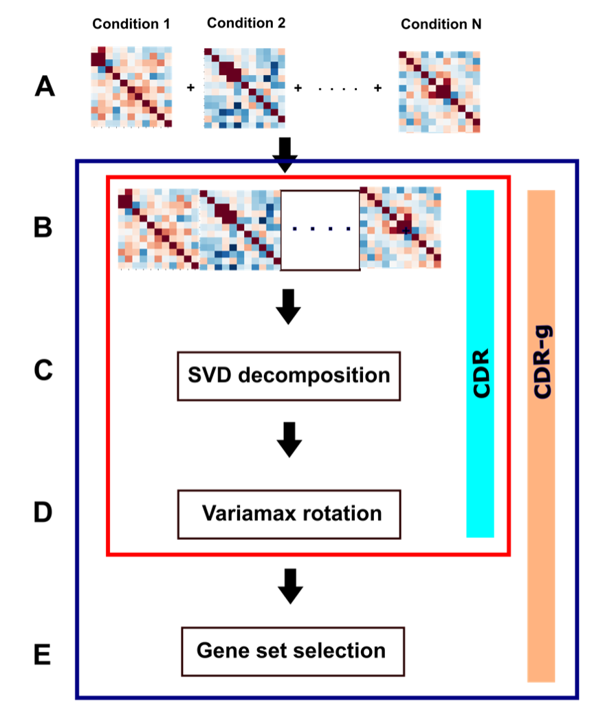

Algorithm description
=================================

The CDR-g approach extends currently available methods for differential expression and differential co-expression to multi-condition data. Briefly, condition-specific variation is captured in by first constructing condition-specific co-expression matrices, which are simulatenously interrogated by applying spectral decomposition to their concatenated product.

The steps in the CDR-g algorithm involve concatenation of condition-specific gene co-expression matrices (A, B) and the decomposition of their product to produce the resulting factor loading matrix using truncated SVD (C) followed by varimax rotation of the resulting factor loading matrix (D), Gene set selection (E) is performed on each rotated factor loading. Genes which distinguish conditions have high factor loading scores and are selected using a permutation filter. The red box describes the original CDR framework as described in [#f1]_ and the blue box describes CDR-g, the extension to multi-condition single cell data.

.. [#f1] Portes LL, Small M. Navigating differential structures in complex networks. Phys Rev E. 2020 Dec;102(6-1):062301. doi: 10.1103/PhysRevE.102.062301. PMID: 33466036.
